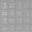

Tests
=====

This document contains a bunch of tests that should be manually checked.

(This should be on the same line) (as this)

(This should be above)  
(this)

Basic styling: *italics*, _italics_, **bold**, __bold__, ~strikethrough~

Fix for issue #15: not bold **bold**not bold

Unlike Typst, bare links are not clickable: https://example.org.  
Angle-bracket links are clickable: <https://example.org>.  
We can also use links with text: [example.org](https://example.org).  
Unlike Typst, we cannot do references with an at sign: @reference.

## Heading 2
### Heading 3
#### Heading 4
##### Heading 5
###### Heading 6

    code block defined through indentation (no syntax highlighting)
	We can put triple-backticks in indented code blocks:
	```rust
	let x = 5;
	```

```rust
// Code block defined through backticks, with syntax highlighting
```

Some `inline code`.

A horizontal rule:

---

- an
- unordered
- list

	with this paragraph nested in the last list element

Inline math: $\int_1^2 x \mathrm{d} x$

Display math:

$$
\int_1^2 x \mathrm{d} x
$$

We can escape things with backslashes:
\*asterisks\*,
\`backticks\`,
\_underscores\_,
\# hashes,
\~tildes\~,
\- minus signs,
\+ plus signs,
\<angle brackets\>.

== Putting equals signs at the start of the line does not make this line into a heading.  

/ Unlike Typst, this line is plain text: and not a term and definition  
Similarly, math mode does not work: $ x = 5 $  
A backslash on its own does not produce a line break: a\b.  
Typst commands do not work: #rect(width: 1cm)  
Neither do Typst comments: /* A comment */ // Line comment  
Neither does tildes: foo~bar  
Neither do Unicode escapes: \u{1f600}

Smart quotes: 'smart quote' "smart quote"  
We can escape them to make not-smart quotes: \'not smart quote\' \"not smart quote\"  
We have Markdown smart punctuation, such as en dashes (-- and –) and em dashes (--- and —).


> Quoted text
>
> > Nested
>
> Unnnested

<!--typst-begin-exclude-->
This should not appear.<!--typst-end-exclude-->

Raw Typst code:

<!--raw-typst $ 2 + 2 = #(2 + 2) $-->

Tables:

| Left-aligned column | Centred column | Right-aligned column | auto |
| :--- | :----: | ----: | ---- |
| 1 | 1 | 1 | 1 |
| this row is incomplete |
| this row has extra cells | 1 | 2 | 3 | 4 |

Images:



[^before]: xyz

Footnotes 1, 2, 1: [^before] [^after] [^before]

[^after]: abc **bold text**

## HTML tests

<sup>superscript</sup>,
<sub>subscript</sub>,
<em>Italics</em>,
<strong>bold</strong>,
<s>strikethrough</s>,
<mark>highlighted</mark>,
<a href="#before">link to the footnote</a>,
<a href="https://example.org/">link to example.org</a>

<h1>h1</h1>
<h2>h2</h2>
<h3>h3</h3>
<h4>h4</h4>
<h5>h5</h5>
<h6>h6</h6>

Below is a `<hr>`:

<hr>


A paragraph<br>
with a `<br>`.

Image with no alt text: 

Image with alt text: 

<ul>
	<li>An</li>
	<li>Ordered</li>
	<li>List</li>
</ul>
<ol>
	<li>An</li>
	<li>Unordered</li>
	<li>List</li>
</ol>

<dl>
	<dt>Term</dt><dd>Definition</dd>
	<dt>Another term</dt><dd>Another
	definition</dd>
</dl>

<table>
	<thead>
		<tr>
			<th>Column 1</th>
			<th>Column 2</th>
			<th>Column 3</th>
		</tr>
	</thead>
	<tbody>
		<tr>
			<td>R1C1</td>
			<td rowspan="2">R1C2 (next cell empty, rowspan = 2)</td>
		</tr>
		<tr>
			<td>R2C1</td>
			<td>R2C3</td>
		</tr>
	</tbody>
	<tfoot>
		<tr><td>Footer R1C1 (rest empty)</td></tr>
		<tr><td colspan="2">Footer R2C1 (colspan = 2)</td></tr>
	</tfoot>
</table>
